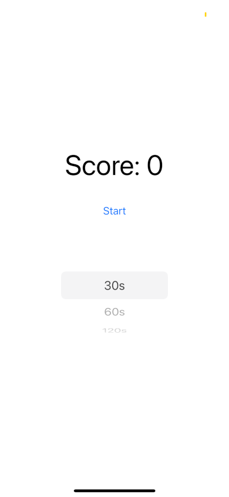
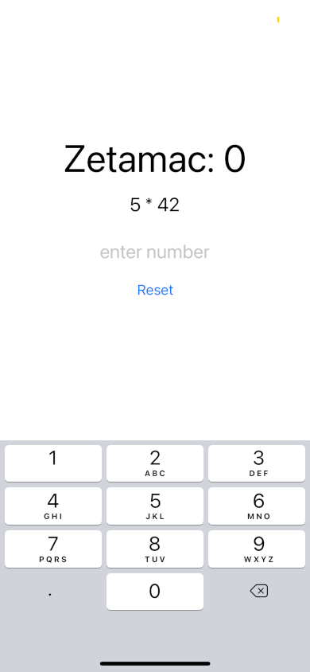

## Zetamac Mobile

There's this cool game called zetamac where you just do arithmetic for 30-120 seconds I made the mobile version of it, that's all. Also here's the original game: https://arithmetic.zetamac.com/

## Future Additions

Alot of these features are for competitive zetamac, at the moment zetamac itself doesn't have these features, so adding these in for a ranked zetamac experience would be hype.

1. Leaderboard
2. Multiplayer (1v1s or NvNs)
3. Ranked (Elo or Rating)
4. Spectator
5. Auth
6. Allow Users To Pick Time

## Screenshots / Gameplay

